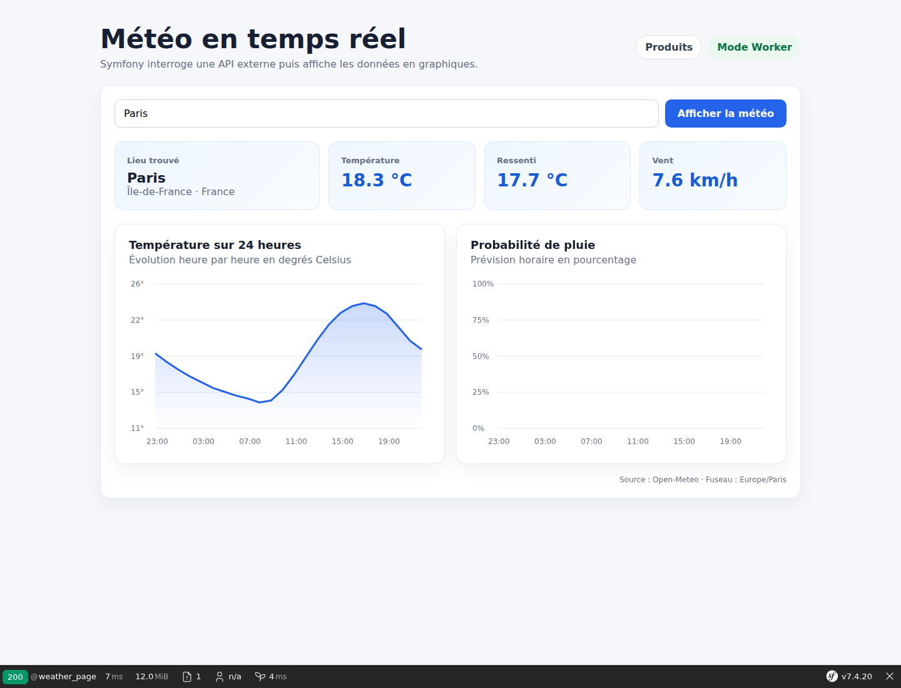

# FrankenPHP + Symfony Lab

Projet pédagogique pour découvrir FrankenPHP avec Symfony 7.4, comparer le mode classique au mode Worker et construire des exemples concrets : API REST, persistance SQLite, interface Twig, API météo et benchmark.



## Contenu du dépôt

```text
.
├── compose.yaml          # Les trois serveurs de démonstration
├── docker/frankenphp/    # Configuration Caddy explicite
├── docs/images/          # Captures utilisées dans la documentation
├── franken-test/         # Application PHP minimale sans framework
└── franken-symfony/      # Application Symfony 7.4 complète
```

Le projet Symfony contient notamment :

- une démonstration de la mémoire entre les requêtes ;
- une API REST de produits avec Doctrine et SQLite ;
- une interface de gestion des produits ;
- une API météo utilisant Symfony HttpClient et Open-Meteo ;
- deux graphiques météo dessinés dans le navigateur ;
- un benchmark interactif classique contre Worker.

## Prérequis

- Docker ;
- Docker Compose v2 ;
- les ports `8282`, `8384` et `8385` disponibles.

PHP, Composer, Symfony CLI et PHP-FPM ne sont pas requis sur la machine hôte.

## Installation

Cloner le dépôt puis se placer à sa racine :

```bash
git clone https://github.com/amine-betari/frankenphp-formation.git
cd frankenphp-formation
```

Installer les dépendances Symfony avec Composer dans Docker :

```bash
docker run --rm \
  --user "$(id -u):$(id -g)" \
  -e COMPOSER_HOME=/tmp/composer \
  -v "$PWD/franken-symfony:/app" \
  -w /app \
  composer:2 install
```

Démarrer les trois serveurs :

```bash
docker compose up -d
```

Créer la base SQLite à partir des migrations :

```bash
docker compose exec symfony-classic \
  php bin/console doctrine:migrations:migrate --no-interaction
```

## URLs

| Exemple | Mode | URL |
|---|---|---|
| PHP minimal | Classique | <http://localhost:8282> |
| Accueil Symfony | Classique | <http://localhost:8384> |
| Accueil Symfony | Worker | <http://localhost:8385> |
| Catalogue interactif | Classique | <http://localhost:8384/products> |
| Catalogue interactif | Worker | <http://localhost:8385/products> |
| Tableau de bord météo | Classique | <http://localhost:8384/weather> |
| Tableau de bord météo | Worker | <http://localhost:8385/weather> |
| Compteur en mémoire | Classique | <http://localhost:8384/demo/compteur> |
| Compteur en mémoire | Worker | <http://localhost:8385/demo/compteur> |
| Laboratoire service coûteux | Classique | <http://localhost:8384/worker-lab> |
| Laboratoire service coûteux | Worker | <http://localhost:8385/worker-lab> |
| Santé Symfony | Classique | <http://localhost:8384/health> |
| Santé Symfony | Worker | <http://localhost:8385/health> |

## Configuration Caddy

Le fichier [`docker/frankenphp/Caddyfile`](docker/frankenphp/Caddyfile) configure explicitement :

- la racine publique `/app/public` ;
- l’exécution PHP avec `php_server` ;
- les compressions Zstandard, Brotli et Gzip ;
- quelques en-têtes HTTP de sécurité ;
- le mode Worker lorsque `FRANKENPHP_CONFIG` est défini.

Chaque service possède également un healthcheck Docker qui appelle `/health` toutes les dix secondes.

## API Produits

| Méthode | Route | Description |
|---|---|---|
| `GET` | `/api/products` | Lister et rechercher les produits |
| `GET` | `/api/products/{id}` | Consulter un produit |
| `POST` | `/api/products` | Créer un produit |
| `PATCH` | `/api/products/{id}` | Modifier partiellement un produit |
| `DELETE` | `/api/products/{id}` | Supprimer un produit |

Exemples supplémentaires : [API_EXAMPLES.md](franken-symfony/API_EXAMPLES.md).

## API météo

L’endpoint suivant recherche une ville et renvoie 24 heures de prévisions normalisées :

```text
GET /api/weather?city=Paris
```

Exemples :

- <http://localhost:8384/api/weather?city=Paris>
- <http://localhost:8385/api/weather?city=Casablanca>

Les données sont fournies par [Open-Meteo](https://open-meteo.com/).

## Mode classique et mode Worker

En mode classique, FrankenPHP reste actif mais Symfony est initialisé pour chaque requête. En mode Worker, le Kernel Symfony reste chargé en mémoire et traite plusieurs requêtes.

```text
Classique : requête → démarrage Symfony → réponse → nettoyage
Worker    : démarrage Symfony → requête 1 → requête 2 → requête 3
```

Le Worker améliore généralement le débit, mais les variables statiques, globales et certains services avec état peuvent survivre entre les requêtes. Il ne faut jamais y conserver des données propres à un utilisateur.

## Benchmark

La page `/products` contient un bouton **Lancer le benchmark**. Elle envoie 200 requêtes avec une concurrence de 10 et affiche le débit, le temps moyen et le p95.

Sur la machine utilisée pendant l’expérience, un test de 1 000 requêtes a donné :

```text
Mode classique : environ 874 requêtes/seconde
Mode Worker    : environ 1 800 requêtes/seconde
```

Ces valeurs sont indicatives et dépendent du matériel, du mode debug et du nombre de workers.

## Laboratoire Worker

La page `/worker-lab` appelle vingt fois les modes classique et Worker. Un service Symfony simule une initialisation coûteuse de 250 ms :

- en classique, le service est recréé à chaque requête ;
- en Worker, son instance reste en mémoire et son compteur augmente.

Ce laboratoire montre aussi pourquoi un service partagé ne doit pas conserver de données propres à un utilisateur.

## Commandes utiles

Afficher les conteneurs :

```bash
docker compose ps
```

Suivre les journaux :

```bash
docker compose logs -f
```

Arrêter le laboratoire :

```bash
docker compose down
```

Afficher les routes Symfony :

```bash
docker compose exec symfony-classic php bin/console debug:router
```

## Articles associés

1. [FrankenPHP avec Symfony 7.4 : mode classique, Worker et benchmark concret](https://www.abetari.com/frankenphp-avec-symfony-7-4-mode-classique-worker-et-benchmark-concret/)
2. [FrankenPHP avec Symfony : Caddyfile, logs, healthchecks et rechargement des Workers](https://www.abetari.com/frankenphp-avec-symfony-caddyfile-logs-healthchecks-et-rechargement-des-workers/)
3. [FrankenPHP Worker avec Symfony : mesurer concrètement la réutilisation des services](https://www.abetari.com/frankenphp-worker-symfony-reutilisation-services/)

La suite de la série est organisée dans la [feuille de route](docs/ROADMAP.md).

## Sécurité

Ce dépôt ne doit contenir aucun mot de passe ni secret de production. Utiliser `.env.local`, ignoré par Git, pour les valeurs locales sensibles.

## Licence

Ce projet est distribué sous licence MIT.
