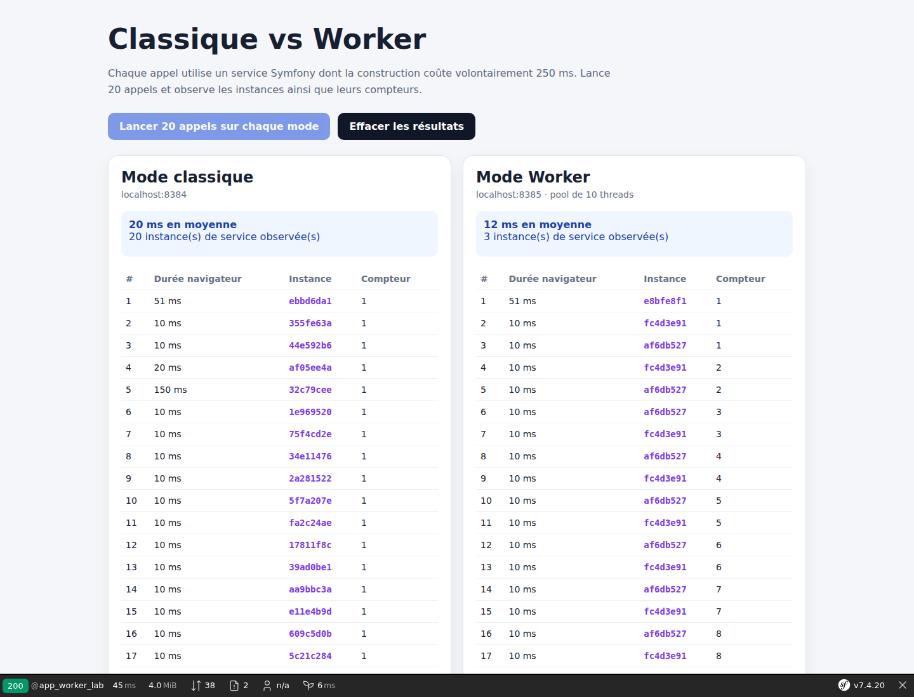

# FrankenPHP Worker avec Symfony : mesurer concrètement la réutilisation des services

Dans les deux premières étapes de notre laboratoire, nous avons lancé Symfony avec FrankenPHP, comparé les modes classique et Worker, rendu le Caddyfile explicite et ajouté des healthchecks. Cette troisième étape répond à une question très concrète : **qu’est-ce que le mode Worker conserve réellement en mémoire ?**

Le projet complet est disponible sur GitHub :

<https://github.com/amine-betari/frankenphp-formation>

## Pas de PHP-FPM dans cette comparaison

Les deux variantes utilisent FrankenPHP. Il n’y a ni Nginx ni PHP-FPM :

```text
Mode classique : Caddy → FrankenPHP → démarrage de Symfony → réponse
Mode Worker     : Caddy → FrankenPHP → Symfony déjà chargé → réponse
```

Le mode classique n’est donc pas PHP-FPM. La différence étudiée concerne le cycle de vie de Symfony.

## Le scénario

Nous créons un service Symfony dont le constructeur attend volontairement 250 ms. Cette attente représente un travail d’initialisation qui pourrait exister dans une vraie application : chargement d’un gros fichier, construction d’un moteur de règles ou initialisation d’un client complexe.

```php
final class ExpensiveReportService
{
    private readonly string $instanceId;
    private int $requestsHandled = 0;

    public function __construct()
    {
        $this->instanceId = substr(bin2hex(random_bytes(8)), 0, 8);
        usleep(250_000);
    }

    public function generate(): array
    {
        ++$this->requestsHandled;

        return [
            'instance_service' => $this->instanceId,
            'requetes_par_instance' => $this->requestsHandled,
        ];
    }
}
```

Cette lenteur est artificielle et pédagogique. Elle ne signifie pas que FrankenPHP classique ajoute normalement 250 ms à chaque requête.

## Une API pour observer l’instance

Le contrôleur expose les informations importantes au format JSON :

```php
#[Route('/api/worker-lab', methods: ['GET'])]
public function api(ExpensiveReportService $reportService): JsonResponse
{
    return $this->json([
        'mode' => getenv('DEMO_MODE') ?: 'inconnu',
        'pid_php' => getmypid(),
        ...$reportService->generate(),
    ]);
}
```

Deux URLs permettent de comparer le résultat :

- classique : <http://localhost:8384/api/worker-lab> ;
- Worker : <http://localhost:8385/api/worker-lab>.

En rechargeant l’API classique, `instance_service` change et `requetes_par_instance` reste à 1. En rechargeant l’API Worker, l’identifiant réapparaît et le compteur augmente.

## Comparaison depuis le navigateur

L’interface <http://localhost:8384/worker-lab> lance vingt appels sur chaque serveur et affiche :



- la durée mesurée par le navigateur ;
- l’identifiant de l’instance du service ;
- le nombre de requêtes traitées par cette instance ;
- la moyenne des vingt appels.

Sur notre machine de test, les appels classiques prennent environ 260 à 275 ms. Après son initialisation, le Worker répond généralement en 2 à 5 ms. Ces chiffres dépendent du matériel et du mode de développement ; c’est le comportement des instances qui constitue la démonstration importante.

## Pourquoi le PID ne suffit pas

Dans cette expérience, `getmypid()` peut retourner le même PID dans les deux modes. C’est normal : FrankenPHP intègre PHP dans Caddy et travaille avec des threads. Nous ne sommes pas dans le modèle traditionnel où Nginx transmet chaque requête à un processus PHP-FPM.

L’identifiant du service Symfony est donc un indicateur plus parlant que le PID pour cette démonstration.

## Le piège des services avec état

La persistance en mémoire améliore les performances, mais impose une règle essentielle : **un service partagé ne doit pas conserver les données d’un utilisateur entre deux requêtes**.

Le compteur de notre exemple survit volontairement pour rendre le phénomène visible. Dans une vraie application, stocker dans une propriété le panier, le jeton ou les informations personnelles de la requête courante risquerait de les exposer à une requête suivante.

Les données propres à une requête doivent rester dans les objets de requête, être passées explicitement aux méthodes ou être nettoyées avec les mécanismes adaptés de Symfony.

## Démarrer le laboratoire

```bash
git clone https://github.com/amine-betari/frankenphp-formation.git
cd frankenphp-formation
docker compose up -d
```

Ouvrez ensuite :

<http://localhost:8384/worker-lab>

## À retenir

- FrankenPHP classique fonctionne déjà sans PHP-FPM.
- En mode classique, Symfony est réinitialisé pour chaque requête.
- En mode Worker, Symfony et ses services partagés peuvent rester en mémoire.
- Une initialisation coûteuse peut donc être amortie sur plusieurs requêtes.
- La mémoire persistante exige de ne pas conserver d’état utilisateur dans les services partagés.

Les deux premières étapes sont disponibles sur le blog :

1. <https://www.abetari.com/frankenphp-avec-symfony-7-4-mode-classique-worker-et-benchmark-concret/>
2. <https://www.abetari.com/frankenphp-avec-symfony-caddyfile-logs-healthchecks-et-rechargement-des-workers/>
