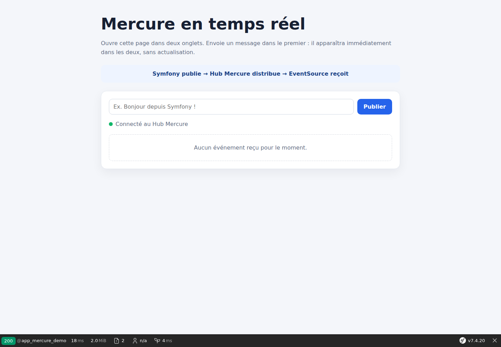

# Mercure avec Symfony : comprendre et créer une première route temps réel

Après avoir étudié FrankenPHP avec Symfony, nous allons découvrir Mercure séparément. Le mode classique ou Worker n’a aucun rôle dans cet exemple : notre objectif est uniquement de comprendre comment une information arrive dans le navigateur en temps réel.

Le code complet est disponible sur GitHub :

<https://github.com/amine-betari/frankenphp-formation>

## Qu’est-ce que Mercure ?

Mercure permet au serveur d’envoyer un événement au navigateur dès qu’une information change. Le navigateur ne recharge pas la page et ne demande pas toutes les secondes si une nouveauté est disponible.

Sans Mercure, une application peut faire du polling :

```text
Navigateur → Y a-t-il un nouveau message ?
Navigateur → Et maintenant ?
Navigateur → Et maintenant ?
```

Avec Mercure, le navigateur ouvre une connexion et attend :

```text
Navigateur ── connexion SSE ouverte ──► Hub Mercure
Symfony ── publie un événement ───────► Hub Mercure
Hub Mercure ── pousse l’événement ────► Navigateur
```

Le **Hub Mercure** est donc un serveur spécialisé dans la distribution des événements. Symfony produit l’information ; le Hub la distribue ; le navigateur la reçoit.

Mercure utilise les **Server-Sent Events**, ou SSE. Dans le navigateur, l’API JavaScript `EventSource` maintient une connexion HTTP ouverte avec le Hub.

## API REST et Mercure ont des rôles différents

Mercure ne remplace ni l’API ni la base de données :

```text
API REST : lire ou modifier les données
Mercure  : annoncer immédiatement qu’un événement vient de se produire
```

Dans notre démonstration, une route Symfony reçoit le message. Symfony le publie vers Mercure, puis Mercure l’envoie à tous les onglets abonnés.

## Architecture de notre exemple

Nous utilisons trois adresses :

| Élément | Adresse | Rôle |
|---|---|---|
| Interface Symfony | `http://localhost:8384/mercure-demo` | Saisir et afficher les messages |
| Route de publication | `POST /api/mercure/publish` | Demander à Symfony de publier |
| Hub Mercure | `http://localhost:3001/.well-known/mercure` | Distribuer les événements SSE |

Le port `3000` était déjà occupé sur notre machine, nous avons donc choisi `3001`. Ce choix n’est pas une obligation de Mercure.



## Étape 1 : installer l’intégration Symfony

La documentation Symfony propose le package `mercure` :

```bash
composer require mercure
```

Dans notre projet, Composer fonctionne dans Docker :

```bash
docker run --rm \
  --user "$(id -u):$(id -g)" \
  -e COMPOSER_HOME=/tmp/composer \
  -v "$PWD/franken-symfony:/app" \
  -w /app \
  composer:2 require mercure
```

Symfony Flex active `MercureBundle` et crée `config/packages/mercure.yaml`.

## Étape 2 : ajouter le Hub dans Docker

Le Hub est un service indépendant. Nous utilisons l’image officielle `dunglas/mercure` :

```yaml
services:
  mercure:
    image: dunglas/mercure
    environment:
      SERVER_NAME: :80
      MERCURE_PUBLISHER_JWT_KEY: mercure-local-development-secret
      MERCURE_SUBSCRIBER_JWT_KEY: mercure-local-development-secret
      MERCURE_TRUSTED_ISSUERS: https://frankenphp.local
      MERCURE_EXTRA_DIRECTIVES: |
        anonymous
        cors_origins http://localhost:8384
        resource_identifier http://localhost:3001/.well-known/mercure
    ports:
      - "3001:80"
```

Les valeurs de cet exemple sont destinées au développement local. Il ne faut pas réutiliser ces secrets dans une application publique.

La directive `anonymous` permet au navigateur de recevoir nos événements publics sans jeton. `cors_origins` autorise la page Symfony du port `8384` à ouvrir une connexion vers le Hub du port `3001`.

## Étape 3 : connecter Symfony au Hub

Le conteneur Symfony reçoit trois variables :

```yaml
environment:
  MERCURE_URL: http://host.docker.internal:3001/.well-known/mercure
  MERCURE_PUBLIC_URL: http://localhost:3001/.well-known/mercure
  MERCURE_JWT_SECRET: mercure-local-development-secret
extra_hosts:
  - "host.docker.internal:host-gateway"
```

Pourquoi deux URLs ?

- `MERCURE_URL` est utilisée par Symfony depuis son conteneur pour publier ;
- `MERCURE_PUBLIC_URL` est donnée au navigateur pour s’abonner.

Notre Hub utilise Mercure 1.0. Le fichier `config/packages/mercure.yaml` déclare donc l’émetteur du jeton :

```yaml
mercure:
  hubs:
    default:
      protocol_version: '1.0'
      url: '%env(default::MERCURE_URL)%'
      public_url: '%env(default::MERCURE_PUBLIC_URL)%'
      jwt:
        secret: '%env(MERCURE_JWT_SECRET)%'
        publish: '*'
        claims:
          iss: 'https://frankenphp.local'
          sub: 'frankenphp-symfony'
          client_id: 'mercure-learning-lab'
```

## Étape 4 : choisir un topic

Un **topic** identifie le canal ou la ressource concernée. Nous utilisons :

```text
https://frankenphp.local/mercure-demo/messages
```

Cette URL sert d’identifiant. Elle n’a pas besoin de correspondre à une vraie page accessible.

Tous les navigateurs abonnés à ce topic recevront les événements qui y sont publiés.

## Étape 5 : publier depuis Symfony

Le contrôleur reçoit un message, construit un événement puis utilise `HubInterface` :

```php
#[Route('/api/mercure/publish', methods: ['POST'])]
public function publish(Request $request, HubInterface $hub): JsonResponse
{
    $message = trim((string) ($request->toArray()['message'] ?? ''));

    $event = [
        'message' => $message,
        'sent_at' => (new \DateTimeImmutable())->format('H:i:s'),
        'event_id' => bin2hex(random_bytes(4)),
    ];

    $hub->publish(new Update(
        'https://frankenphp.local/mercure-demo/messages',
        json_encode($event, JSON_THROW_ON_ERROR | JSON_UNESCAPED_UNICODE),
    ));

    return $this->json(['published' => true, 'event' => $event]);
}
```

Symfony signe sa publication avec le secret JWT. Ce secret reste côté serveur et n’est jamais envoyé dans notre JavaScript.

## Étape 6 : abonner le navigateur

Dans Twig, la fonction `mercure()` construit l’URL d’abonnement avec notre topic :

```javascript
const mercureUrl = {{ mercure(topic)|json_encode|raw }};
const eventSource = new EventSource(mercureUrl);

eventSource.onmessage = event => {
    const data = JSON.parse(event.data);
    console.log('Événement reçu :', data);
};
```

Le navigateur contacte donc directement le Hub sur le port `3001`. La requête reste ouverte. Si la connexion est interrompue, `EventSource` tente automatiquement de se reconnecter.

## Étape 7 : envoyer le message depuis la page

Le bouton appelle notre route Symfony :

```javascript
await fetch('/api/mercure/publish', {
    method: 'POST',
    headers: {'Content-Type': 'application/json'},
    body: JSON.stringify({message: input.value}),
});
```

Cette requête ne contient pas la logique temps réel. Elle demande seulement à Symfony de publier. Le message revient ensuite par l’autre connexion, celle de Mercure :

```text
1. Navigateur → POST Symfony
2. Symfony → publication signée vers le Hub
3. Hub → événement SSE vers tous les navigateurs abonnés
```

## Tester avec deux onglets

Démarrez le projet :

```bash
docker compose up -d
```

Ouvrez deux fois :

<http://localhost:8384/mercure-demo>

Lorsque l’indicateur affiche **Connecté au Hub Mercure**, envoyez un message depuis un onglet. Il apparaît immédiatement dans les deux onglets, sans rechargement.

Dans les outils de développement du navigateur, l’onglet Réseau affiche une requête vers `/.well-known/mercure` qui reste ouverte avec le type `text/event-stream`. C’est la connexion SSE.

## Ce qu’il faut retenir

- Mercure est un Hub spécialisé dans la distribution d’événements.
- Symfony publie les événements vers le Hub.
- Le navigateur contacte directement le Hub avec `EventSource`.
- Le topic indique quels événements le navigateur souhaite recevoir.
- Mercure complète une API REST ; il ne remplace pas la base de données.
- Notre abonnement est anonyme uniquement pour simplifier le laboratoire local.
- Cette démonstration ne dépend pas du mode Worker de FrankenPHP.

Pour aller plus loin, consultez la [documentation Mercure de Symfony](https://symfony.com/doc/current/mercure.html) et la [documentation officielle du Hub](https://mercure.rocks/docs/).
